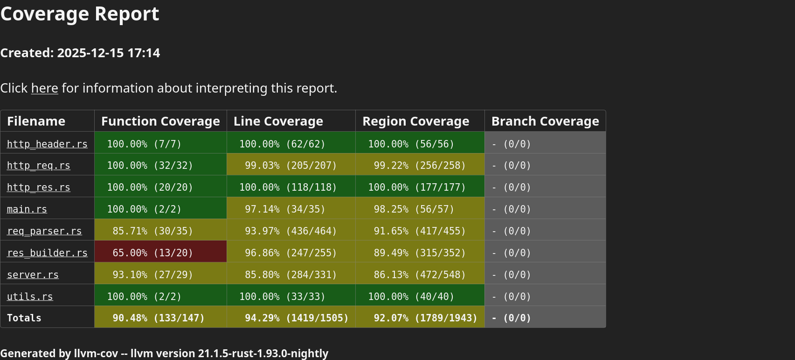

# `rust-http-server`

This project implements an HTTP web server from scratch in Rust. See the [
`project.md`](./project.md) file for more details.

## Usage

To start the server, you need to provide (at least) a socket address to bind (a network interface and a TCP port) and a
directory to serve content from (that will be the root of the server).

Example:

```bash
cargo run --release -- -a 0.0.0.0:8080 -r ./test-root
```

Output:

```text
[2025-12-15T15:30:24Z INFO  rust_http_server] Starting server on 0.0.0.0:8080
[2025-12-15T15:30:24Z INFO  rust_http_server] Server listening
[2025-12-15T15:30:24Z INFO  rust_http_server] Press <q> then <Enter> to stop the server
```

### Logging

This server supports request logging in Common Log Format (CLF). By default, logging is set at `INFO` level. You can
change this behaviour by modifying the `RUST_LOG` environment variable (e.g. `RUST_LOG=debug`).

### HTTPS support

This server supports HTTP over TLS (HTTPS). To enable this, you need to provide a TLS certificate and private key as CLI
arguments. Note that if any of these file is missing (either from the CLI args or unreadable), the server will fall back
to plain HTTP instead.

### Authentication

Content served with this server can be protected with basic HTTP authentication. To enable it, you need to provide a
list of valid credentials (username and password). All content will be served only if the client provides credentials
that match one of this list.

### PHP support

This server supports PHP scripts. All files ending with `.php` will be processed before being sent to the client.

This requires the `php-cgi` program to be installed (for instance, you can get it on Debian-based systems with
`apt install php-cgi`).
You can customize the location of the binary with the `--php-binary` parameter.

### Help

Run the server with no arguments to see all available options.

```bash
cargo run --release
```

Output:

```text
Usage:	./rust-http-server [--help ] [--doc-root DOC-ROOT] [--auth-creds AUTH-CREDS] [--ssl-key SSL-KEY] [--ssl-cert SSL-CERT] [--dir-listing ] [--address ADDRESS] [--php-binary PHP-BINARY] 
Options:

--help (-h)	Required: false	Type: Flag
	Show this help message

--doc-root (-r)	Required: true	Type: Option
	Directory root to serve resources from

--auth-creds (-p)	Required: false	Type: Option
	Comma-separated list of credentials (format: username:password). 
		If provided, the server will only serve content to authenticated 
		clients.

--ssl-key (-k)	Required: false	Type: Option
	SSL key for HTTPS

--ssl-cert (-c)	Required: false	Type: Option
	SSL certificate for HTTPS

--dir-listing (-d)	Required: false	Type: Flag
	Allow directory listing (default: false)

--address (-a)	Required: true	Type: Option
	Socket address to bind

--php-binary (-P)	Required: false	Type: Option
	Alternate path for php binary, used to process PHP scripts with 
		CGI (default: php-cgi)

Error: "Not all required arguments are found"
```

## Testing

To run the unit and integration tests, just run `cargo test`.

### Coverage

To generate test you first need to install [`cargo-llvm-cov`](https://crates.io/crates/cargo-llvm-cov).
Then you can run

```bash 
rustup default nightly # coverage requires nightly for features
RUST_LOG=debug cargo llvm-cov --html
rustup default stable
```

to generate a coverage report in HTML format (`target/llvm-cov/html/index.html`).

Example output:



## Self-signed certificates

For testing purposes, this project uses a self-signed TLS certificate and private key (to enable HTTPS). They are stored
in the [`ssl/`](./ssl) directory of this repository.

For reference, below are the commands used for the generation of the custom CA and certificate signature:

```bash
# based on https://stackoverflow.com/a/76385343

# create a CA
openssl req -x509 -noenc -subj '/CN=localhost' -newkey rsa -keyout ssl/root.key -out ssl/root.crt
# create a certificate signing request (CSR)
openssl req -noenc -newkey rsa -keyout ssl/server.key -out /tmp/client.csr -subj '/CN=localhost' -addext subjectAltName=DNS:localhost
# sign it using the CA
openssl x509 -req -in /tmp/client.csr -CA ssl/root.crt -CAkey ssl/root.key -days 365 -out ssl/server.crt -copy_extensions copy
```